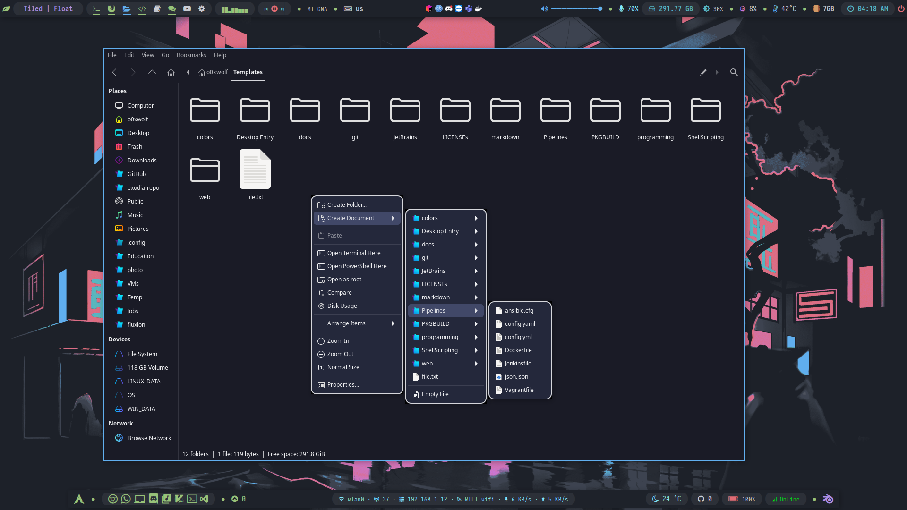

simple templates that help you to create a quick script, programming, web, LICENSEs, Docx, etc...

copy them to the home directory

```bash
cp Templates ~/  
```

if you use [**`Exodia OS`**](https://exodia-os.github.io/exodia-website/), no need to copy them as these templates are pre-added with `exodia-templates` package that is pre-installed

